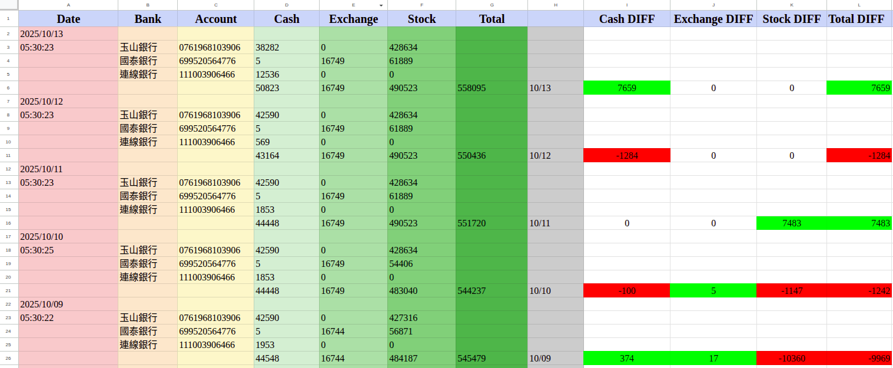
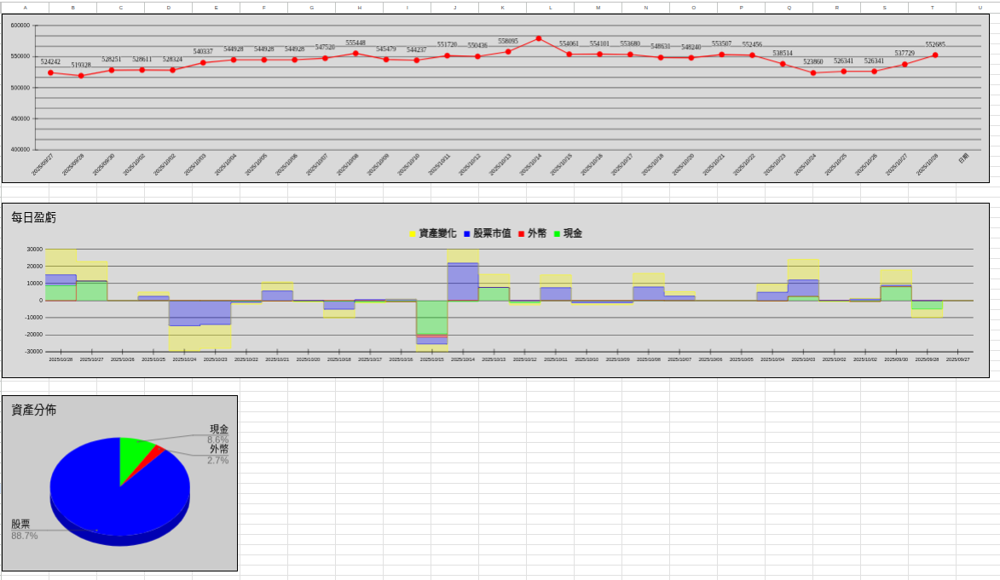

# 自動化記帳

解決資產分散在各個銀行的問題。雖然不像記帳軟體可以清楚紀錄每一筆消費明細，但透過完全每日自動化紀錄總資產取捨。可以透過程式碼自己修改明細想要怎麼呈現，以及Google Sheets的圖表也可以自己調整

1. [核心功能](#%E6%A0%B8%E5%BF%83%E5%8A%9F%E8%83%BD)
2. [Google Sheets統計介面](#google-sheets)
3. [安裝步驟](#%E5%AE%89%E8%A3%9D%E6%AD%A5%E9%A9%9F)
4. []()

## 核心功能

* 透過Python爬蟲爬取網銀資料來完成
  * Function: EsunSpider(), CathaySpider(), LineSpider()
* 每日自動抓取帳號明細到個人Google Sheets
  * 台幣現金
  * 外幣
  * 股票市值
* 自動化彙整分散在各個銀行的帳戶的總資產 
* 顯示在Google Sheets隨時可查看每日資產變化及明細
* 目前支援銀行 （缺點：皆不能開啟兩步驟登入，爬蟲會失敗）
  * 玉山網銀
  * 連線銀行
  * 國泰網銀
## Google Sheets統計介面

### 1. 工作表1明細欄位
* 每日更新時間
* 銀行名稱
* 帳戶號碼
* 現金
* 外幣
* 股票市值
* 總資產
* 現金日變化量
* 外幣日變化量
* 股票日變化量
* 總資產日變化量

工作表1.



### 2. 工作表2圖表

* 總資產水位變化
* 每日盈虧的位置
* 資產分佈

工作表2.



## 安裝步驟

1. 下載主要檔案

    ```bash
    git clone https://github.com/TYCheng31/AutoAccounting.git
    ```

2. 安裝所須套件

    套件一律安裝在python虛擬環境中
    
    ```bash
    python3 -m venv AAVenv
    pip install gspread
    pip install oauth2client
    pip install selenium
    pip install python-dotenv
    ```

3. 設定.env

    設定登入各個網銀的帳號密碼，爬蟲程式會來這邊讀取
    ```
    ESUN_ID=YOUR_ESUN_ID
    ESUN_ACCOUNT=YOUR_ESUN_ACCOUNT
    ESUN_PASSWORD=YOUR_ESUN_PASSWORD

    LINE_ID=YOUR_LINE_ID
    LINE_ACCOUNT=YOUR_LINE_ACCOUNT
    LINE_PASSWORD=YOUR_LINE_PASSWORD

    CATHAY_ID=YOUR_CATHAY_ID  
    CATHAY_ACCOUNT=YOUR_CATHAY_ACCOUNT
    CATHAY_PASSWORD=YOUR_CATHAY_PASSWORD
    ```

4. 設定.json
    
    要到Google API取得個人的資訊，讓程式連接Google Sheets

    ```json
    {
      "type": "service_account",
      "project_id": " ",
      "private_key_id": " ",
      "private_key": " ",
      "client_email": " ",
      "client_id": " ",
      "auth_uri": " ",
      "token_uri": " ",
      "auth_provider_x509_cert_url": " ",
      "client_x509_cert_url": " ",
      "universe_domain": " "
    }
    ```

## 定時執行 （cron job）

1. 進入cron job

    ```bash
    crontab -e 
    ```

2. 新增定時工作

    每天早上5：30執行 （美股收盤且網銀明細更新後）

    ```bash
    30 5 * * * cd /YOUR_PATH_TO/AutoAccounting && 
    bash -c "source /YOUR_PATH_TO/AAVenv/bin/activate &&               /YOUR_PATH_TO/AAVenv/bin/python3 /YOUR_PATH_TO/AutoAccounting/main.py" 
    ```