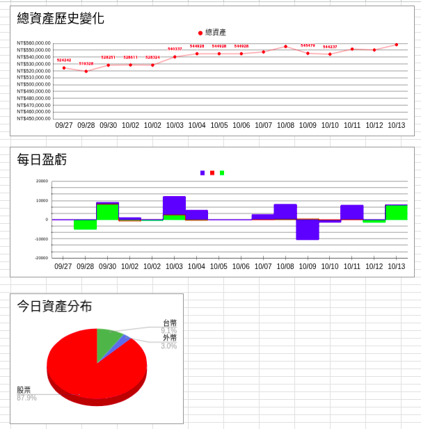

# 自動化記帳

解決資產分散在各個銀行的問題。雖然不像記帳軟體可以清楚紀錄每一筆消費明細，但透過完全每日自動化紀錄總資產取捨。可以透過程式碼自己修改明細想要怎麼呈現，以及Google Sheet的圖表也可以自己調整

## 核心功能

* 透過Python爬蟲爬取網銀資料來完成
* 每日自動抓取帳號明細到個人google sheet
  * 台幣現金
  * 外幣
  * 股票市值
* 自動化彙整分散在各個銀行的帳戶的總資產 
* 顯示在Google Sheet隨時可查看每日資產變化及明細
* 目前支援銀行 （缺點：皆不能開啟兩步驟登入，爬蟲會失敗）
  * 玉山網銀
  * 連線銀行
  * 國泰網銀
## Google Sheet界面

### 1. 工作表1明細欄位
* 每日更新時間
* 銀行名稱
* 帳戶號碼
* 現金
* 外幣
* 股票市值
* 總資產
* 現金日變化量
* 外幣日變化量
* 股票日變化量
* 總資產日變化量

工作表1.

### 2. 工作表2圖表

* 總資產水位變化
* 每日盈虧的位置
* 資產分佈

工作表2.

